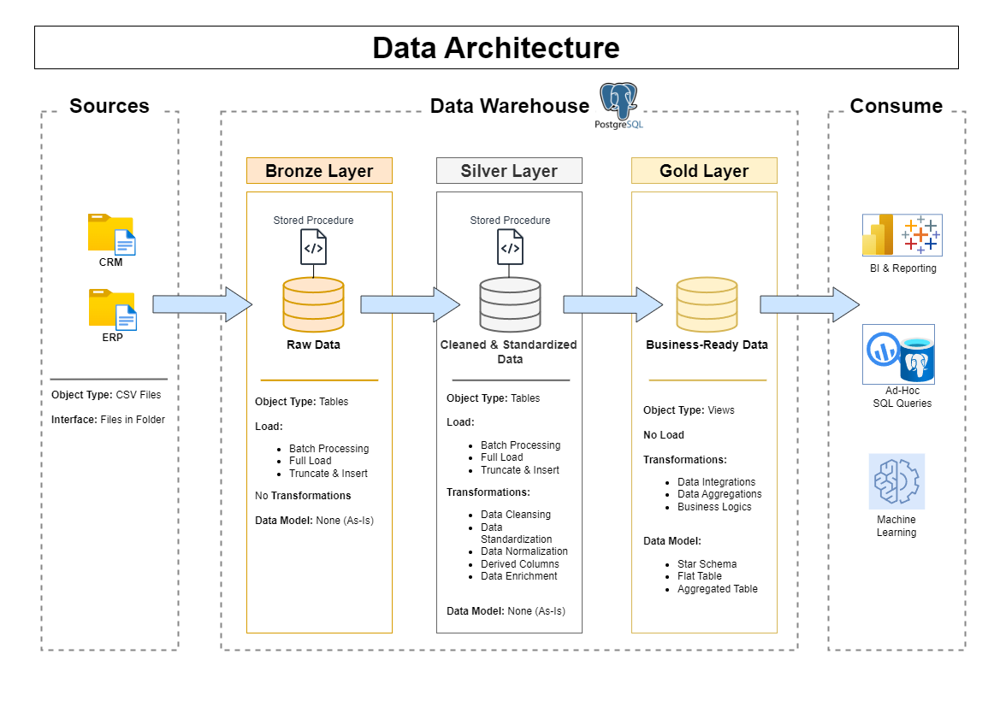

# Data Warehouse and Analytics Project

Welcome to the **Data Warehouse and Analytics Project** repository! 🚀  
This project exemplifies a robust data warehousing and analytics solution, encompassing the building of a data warehouse and the generation of actionable insights. Designed as a portfolio piece, it demonstrates industry-leading practices in data engineering and analytics.

---

## 📖 Project Overview

This project encompasses:

1. **Data Architecture**: Architecting a modern data warehouse utilizing the Medallion Architecture, structured into **Bronze**, **Silver**, and **Gold** layers.
2. **ETL Pipelines**: Extracting, transforming, and loading data from disparate source systems into the warehouse.
3. **Data Modeling**: Crafting fact and dimension tables optimized for analytical querying.
4. **Analytics & Reporting**: Developing SQL-based reports and dashboards to derive actionable insights.
---

## 🛠️ Tools & Resources

Everything is free!
- **[Datasets](datasets/)**: Access the project datasets (CSV files).
- **[PostgreSQL](https://www.postgresql.org/download/)**: Open-source relational database for hosting your data warehouse.
- **[pgAdmin](https://www.pgadmin.org/)**: GUI for managing and interacting with PostgreSQL databases.
- **[Notion Project Steps](https://shorturl.at/TIc1c)**: Access all project phases and tasks.

---

## 🚀 Project Requirements

### Building the Data Warehouse (Data Engineering)

#### Objective
Construct a modern data warehouse using PostgreSQL to consolidate sales data, facilitating analytical reporting and informed decision-making.

#### Specifications
- **Data Sources**: Import data from two source systems (ERP and CRM) provided as CSV files.
- **Data Quality**: Cleanse and resolve data quality issues prior to analysis.
- **Integration**: Merge both sources into a single, user-friendly data model designed for analytical queries.
- **Scope**: Focus exclusively on the latest dataset; historization of data is not required.
- **Documentation**: Provide comprehensive documentation of the data model to support both business stakeholders and analytics teams.

---

### BI: Analytics & Reporting (Data Analysis)

#### Objective
Develop SQL-based analytics to deliver granular insights into:
- **Customer Behavior**
- **Product Performance**
- **Sales Trends**

These insights empower stakeholders with critical business metrics, enabling strategic decision-making. 

---

## 🏗️ Data Architecture

The data architecture for this project adheres to the Medallion Architecture, comprising **Bronze**, **Silver**, and **Gold** layers:
1. **Bronze Layer**: Stores raw data in its original form from the source systems. Data is ingested from CSV files into the PostgreSQL database.
2. **Silver Layer**: Involves data cleansing, standardization, and normalization processes to prepare data for analysis.
3. **Gold Layer**: Hosts business-ready data modeled into a star schema for reporting and analytics.



---

---

## 📂 Repository Structure
```
PostgreSQL_Data_Warehouse_Solution/
│
├── datasets/ # Raw datasets used for the project (ERP and CRM data)
│
├── docs/ # Project documentation and architecture details
│ ├── etl.png # A diagram created in Draw.io showing ETL techniques and methods used in this project
│ ├── data_architecture.png # A diagram created in Draw.io showing the project's architecture
│ ├── data_catalogue.md # Catalog of datasets, including field descriptions and metadata
│ ├── data_flow.png # A diagram created in Draw.io for the data flow diagram
│ ├── data_integration_model.png # A diagram created in Draw.io that shows how tables are related to each other.
│ ├── gold_layer_data_model.png # A diagram created in Draw.io that shows gold layer data model (star schema)
│ ├── naming-conventions.md # Consistent naming guidelines for tables, columns, and files
│
├── scripts/ # SQL scripts for ETL and transformations
│ ├── bronze/ # Scripts for extracting and loading raw data
│ ├── silver/ # Scripts for cleaning and transforming data
│ ├── gold/ # Scripts for creating analytical models
│
├── tests/ # Test scripts and quality files
│
├── README.md # Project overview and instructions
├── LICENSE # License information for the repository
├── .gitignore # Files and directories to be ignored by Git
```
---


## 🛡️ License

This project is licensed under the [MIT License](LICENSE). You are free to use, modify, and share this project with proper attribution.
